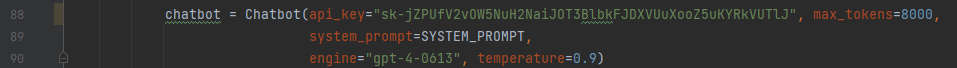

# YouTube Article Generator / Valuva
## Java
- Проект можно запустить с помощью Maven (3.8.2+, wrapper прилагается): `mvn clean compile quarkus:dev`
- Собрать в `.jar` - `mvn clean package -DskipTests`
- OpenAPI спецификация и описание нужных схем находится в `./openapi.yaml`
- Swagger-UI доступен через `http://localhost:8081/q/dev` во вкладке `Swagger UI`

## Python
- Для функционирования библиотеки для скачивания и конвертации видео с YouTube `yt-dl` необходим `ffmpeg` кодировщик. Его можно установить на Windows OS с помощью `choco install ffmpeg`, имея `chocolatey`
- Все токены, используемые в Python Backend будут актуальны некоторое время, после чего станут невалидными ввиду безопасности данных
- Модель OpenAI Whisper-v2 распространяется под лицензией Apache-2.0. Ввиду ресурсов используется Replicate в качестве хостинга модели
- Модель instruct_rugptlarge распространяется под лицензией Apache-2.0. Ввиду ресурсов используется HuggingFace в качестве хостинга модели
- **Необходимо убрать пробелы в `api_key`. OpenAI деактивирует токен если он попадает в публичный репозиторий:
-  - строки 88 и 93

Обратите внимание на версии языков, их можно адаптировать под себя.